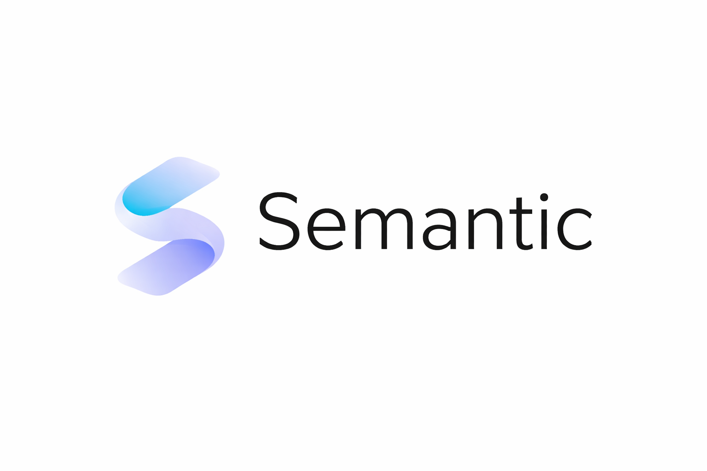

<p align="center">
  
</p>

# Semantic
Deterministic, contract-driven compiler/runtime system with SemCode emission, verifier admission, and VM execution.

https://youtu.be/SKV-TfaJ0Fg?si=Yugp9o4M2mU8ZkX0

Semantic is a deterministic compiler/runtime system for contract-bound
source-to-execution workflows. Current repository `main` includes broader
language and platform work than the currently published stable line, so release
reading must follow the canonical status model rather than assuming all landed
behavior is promised.

The public contract is centered in `docs/spec/*`. Historical roadmap notes and legacy compatibility shims remain in the repository, but they are not the primary source of truth for the current toolchain surface.

## Current Status
Status: current-main orientation page
Audience: repository Wiki / first-contact project readers
Last synced from repository audit: after PR #353 and tracking issue #354

1. Short positioning
Semantic Language is not only a programming language and not only syntax sugar over an existing VM.

It is a deterministic, contract-driven execution platform for meaning-oriented programs, reasoning rules, semantic state transitions, and controlled runtime effects.

The current architecture is best read as:

Semantic source
  -> frontend / semantic analysis
  -> IR / deterministic passes
  -> SemCode
  -> verifier admission
  -> deterministic VM
  -> PROMETHEUS boundary
  -> state / rules / audit / UI boundary
2. Current public posture
Use the canonical status vocabulary from:

docs/roadmap/public_status_model.md
The repository distinguishes four status families:

published stable
qualified limited release
landed on main, not yet promised
out of scope
Important rule:

Landed on main does not automatically mean published stable.
The current repository should be read as a strong limited-release / current-main development line, with several post-stable capabilities already landed but not automatically promoted into a stable public promise.

3. Core architecture
The current owner-split workspace is organized around these layers.

Semantic core
sm-front — frontend, parsing, source typing surface
sm-sema — semantic analysis support
sm-ir — IR and deterministic optimization passes
sm-emit — SemCode emission
sm-verify — verifier / admission gate
sm-runtime-core — runtime-safe shared execution vocabulary
sm-vm — deterministic SemCode VM
smc-cli — command-line tooling pipeline
low-level quad primitive compatibility perimeter — retained as non-owning historical/support surface; see docs/legacy-map.md for the exact inventory
PROMETHEUS integration layer
prom-abi — host-call ABI vocabulary
prom-cap — capability policy
prom-gates — gate descriptors and binding layer
prom-runtime — runtime session orchestration
prom-state — semantic state store
prom-rules — deterministic rule agenda and rule evaluation
prom-audit — audit, trace, replay-oriented records
UI / application boundary
prom-ui
prom-ui-runtime
prom-ui-demo
apps/workbench
The UI layer is an operator/application shell. It does not own compiler, verifier, VM, or Semantic runtime semantics.

4. Execution model
Semantic execution is verifier-first.

source
  -> AST
  -> typed source model
  -> IR
  -> optimized IR
  -> SemCode
  -> verified program
  -> VM state transition
  -> optional PROMETHEUS host boundary
Mathematically, VM execution is a deterministic state transition system:

sigma[k+1] = delta(sigma[k], instr[pc])
Where VM state includes at least:

pc, registers, frames, locals, quotas, active ownership paths, capability context, host boundary
5. Quad logic
Semantic has a native quad value domain:

N = unknown
F = false
T = true
S = conflict
A useful implementation model is two-plane logic:

N = (0, 0)
F = (0, 1)
T = (1, 0)
S = (1, 1)
Important source rule:

if quad_expr    // forbidden
if state == T   // explicit comparison required
This keeps branch control boolean while allowing semantic data to carry unknown and conflicting evidence.

6. Current landed capability highlights
Current main includes substantial language and runtime surface beyond the early stable line, including:

native quad logic;
bool, i32, u32, f64, fx, text, unit;
measured numeric forms / units-of-measure surface;
records and ADTs;
enum constructor and enum match paths;
Option(T) and Result(T, E) families;
tuple and record destructuring paths;
sequence values and first-wave sequence iteration;
first-class closures with immutable capture;
function contracts: requires, ensures, invariant;
deterministic imports / selected executable imports in the currently admitted contour;
SemCode version ladder through ownership, closures, sequence iteration, and host-call capabilities;
verifier-admitted VM execution;
runtime quotas and bounded execution model;
runtime ownership slice for tuple and direct record-field paths;
PROMETHEUS host-call boundary through ABI/capability layers;
semantic state, rules, agenda, rollback/audit-oriented substrate.
These capabilities must still be read through the public status model: not every landed capability is automatically a published stable promise.

7. Runtime ownership status
The current runtime ownership contract is intentionally narrow and frozen around tuple and direct record-field paths.

Supported:

tuple AccessPath;
direct record field AccessPath;
Borrow and Write ownership events;
OWN0 SemCode section;
SEMCOD11 tuple ownership transport;
SEMCOD12 direct record-field ownership transport;
frame-local borrow lifetime;
runtime write rejection on overlap.
Explicitly unsupported in the current ownership contract:

ADT payload paths;
schema paths;
partial borrow release before frame exit;
advanced aliasing / region reasoning;
inter-frame borrow persistence;
indirect field selection;
smart path normalization.
8. Current cleanup milestone
Repository-tail cleanup is tracked in:

GitHub issue #354 — M-Tail: Repository Tail Cleanup
Scope of that cleanup milestone:

classify and clean stale codex/* branches;
resolve closed-unmerged PR / branch tails such as #324;
sync application ledger truth without pulling in snake implementation;
audit panic! surface;
audit allow(dead_code) / compatibility allowances;
verify legacy/perimeter truth;
separate Workbench backlog from Semantic core cleanup.
Explicitly excluded from that milestone:

self-learning snake / benchmark-class application-completeness work;
new language/runtime feature implementation;
runtime ownership expansion;
Workbench feature expansion;
public release claim widening.
9. Active application-completeness stream
The self-learning snake / benchmark-class application stream is intentionally separate from repository-tail cleanup.

It is tracked through:

docs/roadmap/application_completeness_pr_ledger.md
tests/fixtures/snake_benchmark/README.md
tests/snake_benchmark_gap_matrix.rs
Current benchmark-positive baseline includes:

same-family text equality;
enum/control-flow basics;
same-family plain i32 relational operators;
ordered Sequence(T) indexing and iteration;
first-class closure capture.
Known benchmark-family blockers remain in the application-completeness stream rather than the cleanup milestone, including:

public integer arithmetic;
mutable locals / reassignment;
statement loops and control exits;
sequence utility layer;
first-wave map surface;
deterministic seeded PRNG;
text concatenation / minimal formatting;
narrow stdout experiment surface.
10. Legacy and compatibility perimeter
The repository intentionally retains a narrow non-owning compatibility perimeter. The exact path inventory is intentionally kept in the dedicated legacy map rather than repeated here:

docs/legacy-map.md
This perimeter is historical/compatibility-oriented. It is not a second owner of the sm-* Semantic platform contracts.

Any new architecture must land in the appropriate owner crate, not in legacy or compatibility paths.

11. Practical reading order
For a new reader, the recommended order is:

README.md
docs/roadmap/public_status_model.md
docs/roadmap/v1_readiness.md
reports/g1_release_scope_statement.md
docs/spec/syntax.md
docs/spec/types.md
docs/spec/source_semantics.md
docs/spec/semcode.md
docs/spec/verifier.md
docs/spec/vm.md
docs/spec/runtime_ownership.md
docs/architecture/blueprint.md
12. Current engineering rule
The current repository discipline is:

one logical change
  -> one PR
  -> tests where behavior changes
  -> docs/spec sync where contract changes
  -> no silent release claim widening
If a cleanup task starts requiring new language/runtime capability, it should leave the cleanup milestone and move into the appropriate feature or application-completeness stream.
## Primary References
- `docs/spec/index.md` - canonical spec bundle entrypoint
- `docs/spec/syntax.md` - source syntax contract
- `docs/spec/types.md` - source type contract
- `docs/spec/source_semantics.md` - source execution and binding semantics
- `docs/spec/semcode.md` - SemCode contract and version policy
- `docs/spec/verifier.md` - admission verifier contract
- `docs/spec/vm.md` - VM execution contract
- `docs/spec/runtime_ownership.md` - frozen tuple + direct record-field runtime ownership contract
- `docs/spec/cli.md` - public CLI surface
- `docs/LANGUAGE.md` - language overview and design intent
- `docs/NAMING.md` - naming rules and short forms

## What Is In The Repository
- Source frontend: lexer, parser, typing, and source-surface ownership work in `crates/sm-front`
- Semantic analysis and diagnostics in `crates/sm-sema`
- Lowering, IR, optimization passes, and canonical SemCode contract in `crates/sm-ir`
- Producer-facing SemCode facade in `crates/sm-emit`
- Structural SemCode admission verifier in `crates/sm-verify`
- Shared runtime vocabulary and quotas in `crates/sm-runtime-core`
- Verified-only VM execution in `crates/sm-vm`
- Canonical public CLI owner in `crates/smc-cli`
- Additional boundary/runtime crates currently present on `main`:
  - `crates/prom-abi`
  - `crates/prom-cap`
  - `crates/prom-gates`
  - `crates/prom-runtime`
  - `crates/prom-state`
  - `crates/prom-rules`
  - `crates/prom-audit`
  - `crates/prom-ui`
  - `crates/prom-ui-runtime`
  - `crates/prom-ui-demo`
- Compatibility perimeter:
  - `src/bin/ton618_core.rs`
  - `crates/ton618-core`

## Quickstart
Use these commands from repository root.

```powershell
# 1) Build the public entrypoints
cargo build --bin smc --bin svm

# 2) Create a minimal program
@'
fn main() {
    return;
}
'@ | Set-Content program.sm

# 3) Check source
cargo run --bin smc -- check program.sm

# 4) Compile source -> SemCode
cargo run --bin smc -- compile program.sm -o program.smc

# 5) Verify compiled SemCode
cargo run --bin smc -- verify program.smc

# 6) Run source directly
cargo run --bin smc -- run program.sm

# 7) Run precompiled SemCode through the standard CLI route
cargo run --bin smc -- run-smc program.smc

# 8) Disassemble SemCode
cargo run --bin svm -- disasm program.smc
```

For a fuller onboarding path, see:

- `docs/getting_started.md`
- `docs/examples_index.md`

## Current CLI Surface
Current command families exposed by `smc`:
- `compile`
- `check`
- `lint`
- `watch`
- `fmt`
- `dump-ast`
- `dump-ir`
- `dump-bytecode`
- `hash-ast`
- `hash-ir`
- `hash-smc`
- `snapshots`
- `features`
- `explain`
- `repl`
- `verify`
- `run`
- `run-smc`
- `disasm`

Low-level VM entrypoint:
- `svm run <input.smc>`
- `svm disasm <input.smc>`

## Current SemCode And Runtime Notes
- The SemCode contract is owned by `sm-ir` and surfaced through `sm-emit`.
- The current spec documents a versioned SemCode family and capability-gated emission.
- Standard `.smc` execution is verifier-first; verified admission is not optional on the public route.
- The current runtime ownership slice is intentionally narrow:
  - tuple paths
  - direct record-field paths
  - frame-local borrow lifetime
  - exact overlap rejection
  - parent-child rejection
  - child-parent rejection
  - sibling writes allowed
  - unsupported: ADT payload paths, schema paths, partial release, aliasing graphs, inter-frame persistence, and indirect projections

## Testing
```powershell
cargo fmt --check
cargo test -q
cargo test -q --test public_api_contracts
cargo test -q --test runtime_ownership_e2e
```

## no_std Smoke Check
Core library supports `no_std` mode.

```powershell
cargo check --no-default-features
```

Reference:
- `docs/NO_STD.md`

## License
Apache License 2.0

Copyright (c) 2026 Said Kulmakov

See `LICENSE` for the repository license text.
